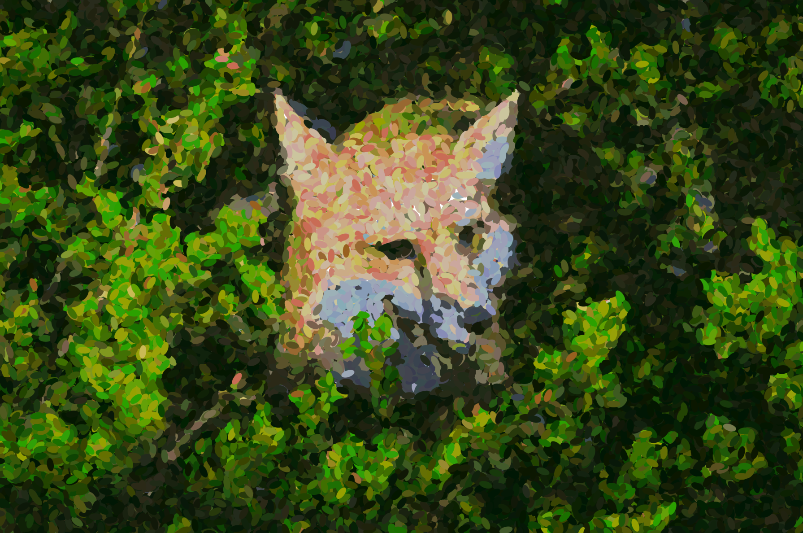
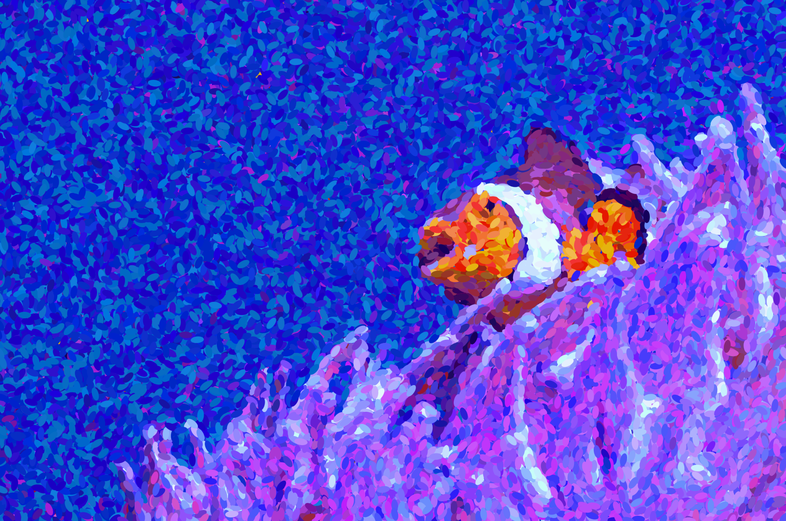
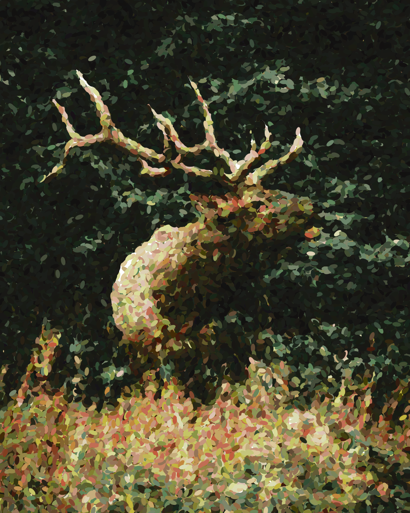
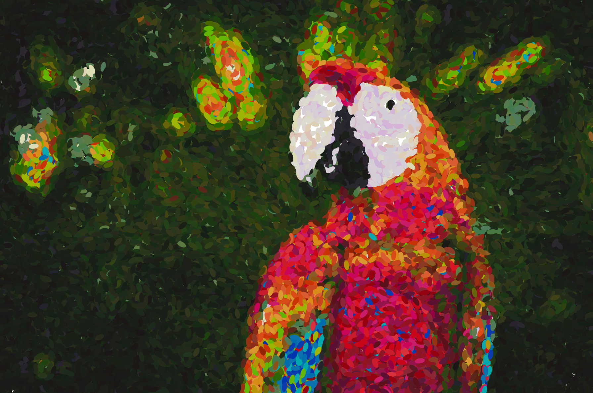

# D(r)a[r]win(g)

**Also see my blogposts [HERE](https://www.berryvansomeren.com/posts/drarwing), and [HERE](https://www.berryvansomeren.com/posts/drarwing_extra)!** ✨

Drawing using Darwinian principles.  
We use the principles of reproduction, mutation and survival of the fittest to evolve beautiful images.

    

## Gallery
Some examples of results. The code for all of these can be found in _mains/batch_processing.py_.

    

        
    

    

        
    

    

        
    

    

        
    

    

        
    

    

        
    

    

        
    

    

        
    

## Evolution of Images
Darwin defined evolution as "descent with modification". 
DNA defines a specimens properties. 
Specimen whose properties better fit their environment produce more offspring. 
Offspring differs from its ancestors through mutations in their DNA.

We can use a similar process to achieve arbitrary goals as long as we modify our definitions of these three rules appropriately. 
In this project "fitness" simply measures how well an image approximates a target image.
The DNA of our image defines what brush strokes to make on a canvas to paint the image. 
Every mutation could add a brush stroke to our image, or change the properties of an already existing brush stroke.

Tricks I have used to speed up convergence and improve looks include; 
using the differences with the target image to further guide the area of mutation,
using the magnitude of the overall differences to scale modifications,
and using the gradient of the target image to guide the direction of brush strokes. 
However, instead of optimizing perfectly, we embrace the random number generator,
and allow it to select suboptimal modifications in order to achieve a more artsy effect. 

This project was inspired by:
- https://github.com/anopara/genetic-drawing
- https://github.com/matteo-ronchetti/Pointillism
